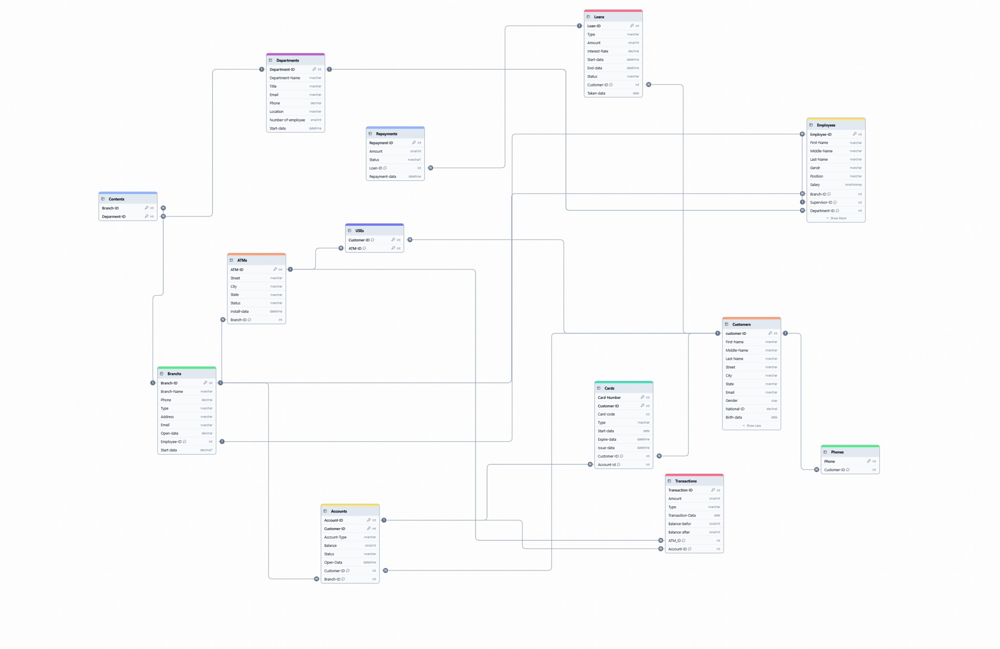

# Bank Management System 💰

Bank Management System is a modern, dark-themed ASP.NET Core MVC web application designed to manage financial entities, coordinate employee operations, and handle transactions. This platform features secure user authentication and gives administrators and employees an elegant, interactive dashboard to manage branches, customers, bank accounts, and financial transfers.

The application is built using the ASP.NET MVC architecture and leverages Entity Framework Core alongside ASP.NET Core Identity for secure access control.





## Key Features

*   **Role-Based Access Control:** Secure portal with dedicated roles for Administrators and Employees.
*   **Modern Glassmorphism Design:** Dark theme styling with glowing neon accents (`#00fd83`), custom-themed buttons, interactive floating particle networks, and sleek hover effects.
*   **Customer & Account CRUD:** Comprehensive tools to create, view, edit, and close bank accounts and customer profiles.
*   **Transaction Management:** Seamless transaction pipeline supporting Deposits, Withdrawals, and Peer-to-Peer Transfers.
*   **Visual Documentation:** Interactive, built-in PDF viewers to inspect the system's Entity Relationship Diagram (ERD) and Schema.
*   **Auto-Migrations & Seeding:** Startup initialization automatically updates local databases and seeds realistic dummy data for testing.
*   **Toastr & SweetAlert Notifications:** Dynamic pop-ups and notifications for seamless UX confirmation.

## Tech Stack

*   **Backend & Framework:** ASP.NET Core 9.0 (MVC Pattern)
*   **Database & ORM:** SQL Server (LocalDB/Express), Entity Framework Core
*   **Authentication & Security:** ASP.NET Core Identity
*   **Frontend UI & Libraries:** HTML5, CSS3, Bootstrap 5, FontAwesome, Bootstrap Icons
*   **Animations & FX:** particles.js (custom dark configuration), Typed.js, SweetAlert2, Toastr.js

## How It Works

1.  **Authentication & Authorization:** When navigating to the site, users must authenticate. Based on their registered role (`Admin` or `Employee`), the layout navbar adapts dynamically to show relevant table routes.
2.  **Entity Management:** Authorized staff can perform CRUD operations on database entities (Branches, Employees, Customers, and Accounts), which persist immediately into the database via Entity Framework Core.
3.  **Financial Operations:** During transfers or transactions, the system updates ledger records in `Transactions` and adjusts `Balance` records on affected bank accounts concurrently.
4.  **Automatic Provisioning:** On launch, the Program class applies pending migrations and runs the database seeder logic, preparing the environment instantly.

## Getting Started

To run the Bank Management System project locally, follow the steps below.

### Prerequisites

*   .NET 9.0 SDK
*   SQL Server Express (or LocalDB) running locally

### 1. Clone the Repository

```bash
git clone https://github.com/saeedm0hamed/BankSystem.git
cd BankSystem
```

### 2. Configure Database Connection

The application uses SQL Server. Check [**`appsettings.json`**](file:///s:/projects/programming/csharp/Bank/BankSystem/Bank.Web/appsettings.json) in the `Bank.Web` project and update your connection string under `ConnectionStrings:DefaultConnection` if you use a different SQL Server instance:

```json
"ConnectionStrings": {
  "DefaultConnection": "data source=.\\SQLEXPRESS;initial catalog=Bank;integrated security=true;trustservercertificate=true;"
}
```

### 3. Restore Dependencies and Build

```bash
dotnet restore
dotnet build
```

### 4. Run the Application

```bash
dotnet run --project Bank.Web
```

Once running, open [http://localhost:8080](http://localhost:8080) in your browser to interact with the application.
